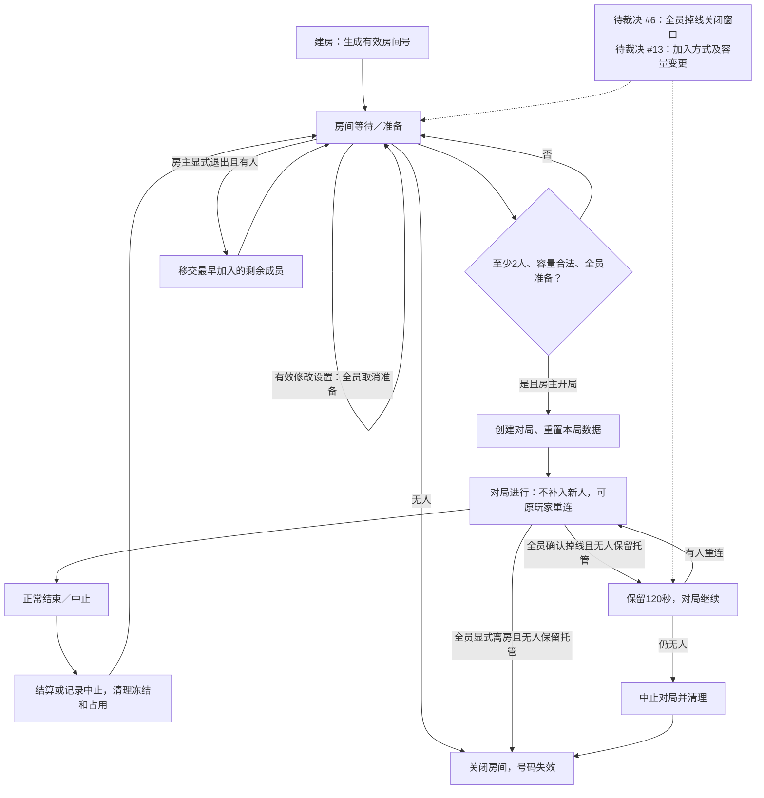
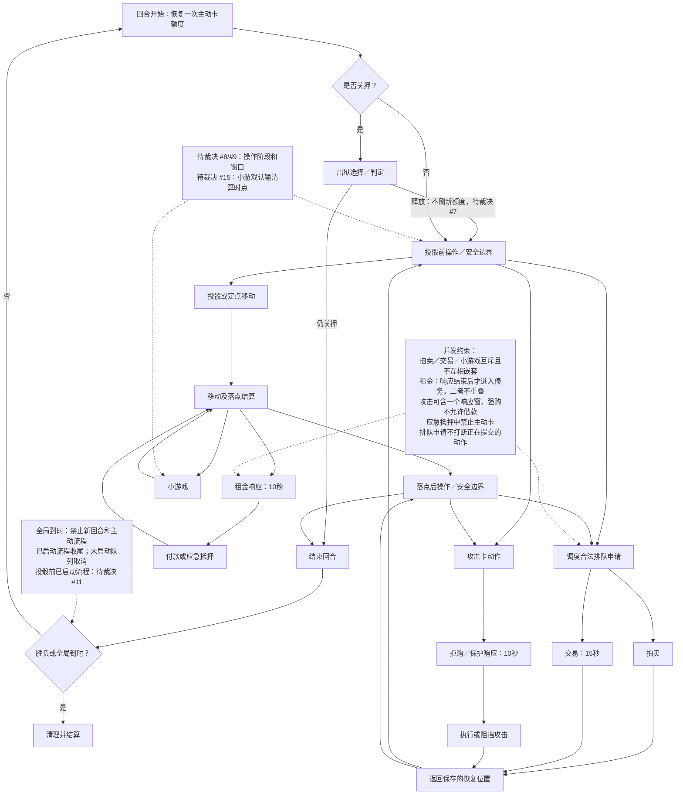
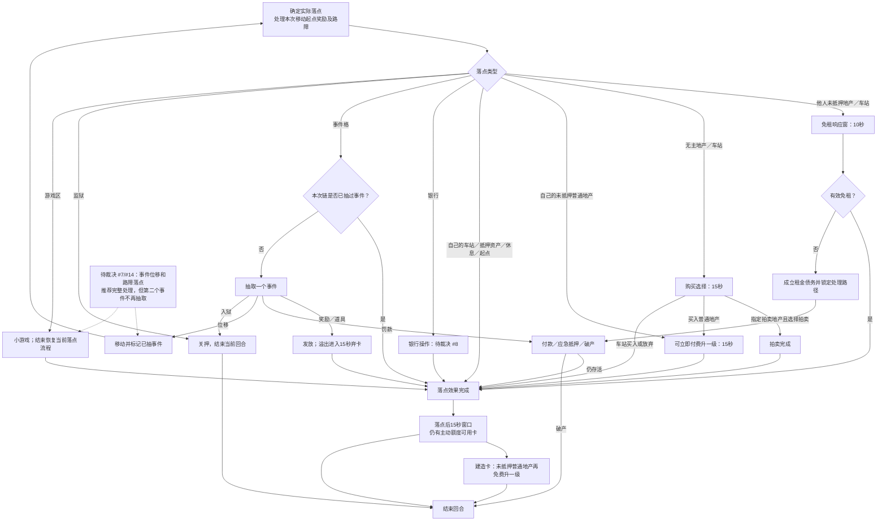
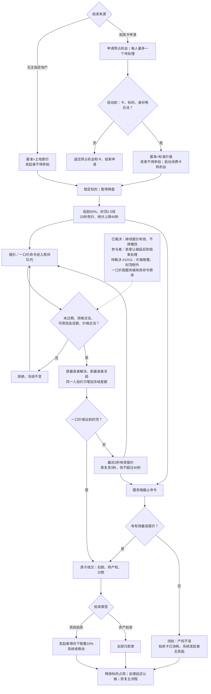
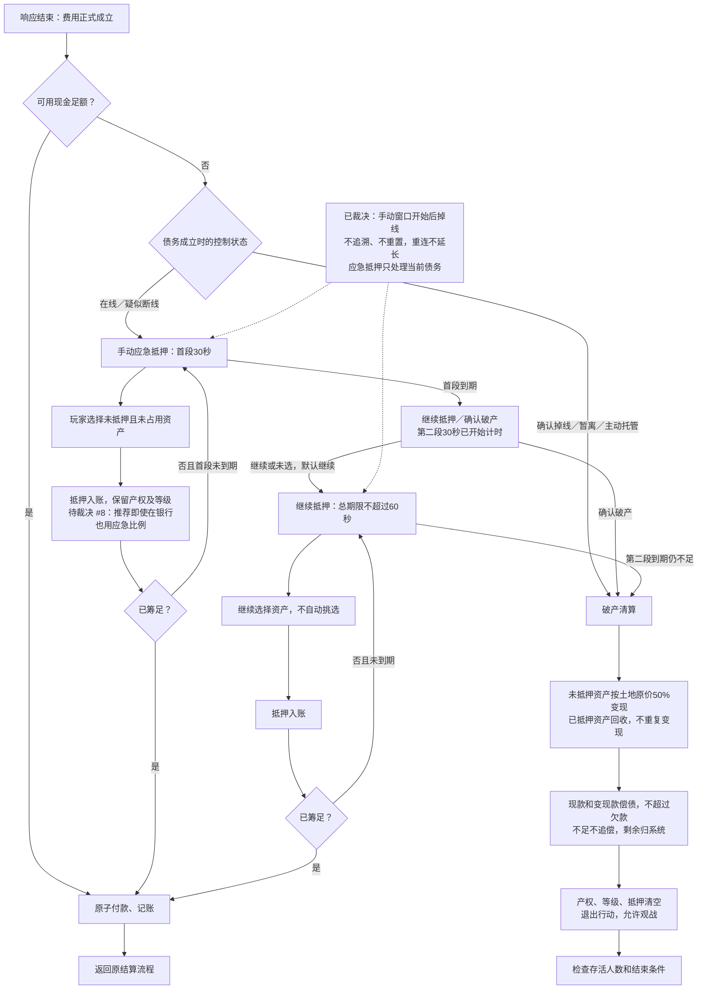
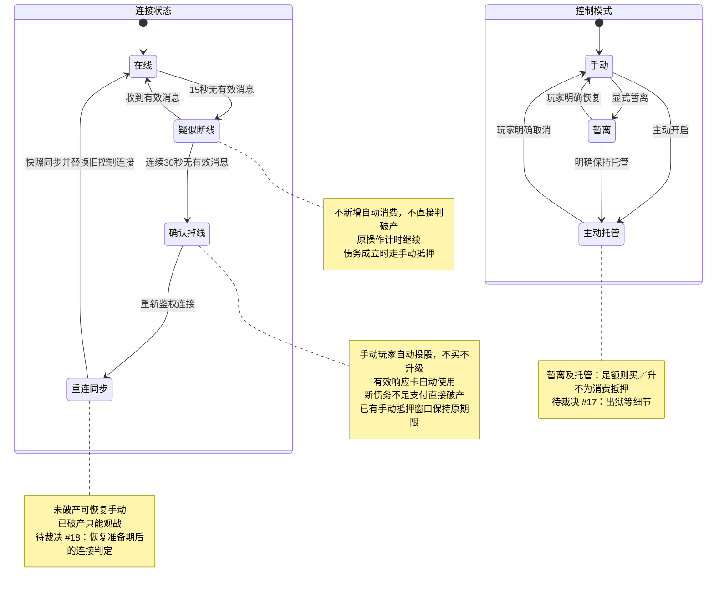
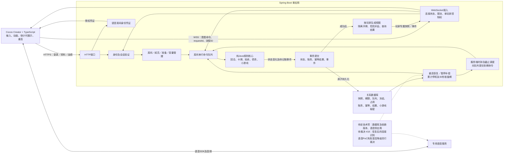

# 设计图（Mermaid）

日期：2026-10-05。由 Codex 起草、Claude 复核，与 open-decisions.md 的"已裁决事项"一致。
状态：设计底稿，未实现。图中标"待裁决 #编号"的分支，以推荐方案绘制，最终以 open-decisions.md 为准。
查看方式：支持 Mermaid 的 Markdown 预览器，或粘贴到 https://mermaid.live 。

## 1. 房间生命周期

房主只控制开局前操作；进行中由服务器推进，掉线不等于立即无人关闭。

## 2. 对局回合分层状态机

拍卖、交易、小游戏互斥；响应和欠款是特定动作的子流程，排队申请只在安全边界启动。

返回箭头表示恢复到**实际保存的一个位置**，不是重新打开两个窗口；计时恢复剩余值，不重置。

## 3. 落点结算顺序

各格是互斥分支，不是每次落点都依次购买、抽事件、玩小游戏；租金结清前禁止用攻击卡改变本次费用。

## 4. 拍卖流程

两类拍卖共用竞价引擎，区别在基准价值、卖家资格及分款对象；每个有效新最高价更新资金冻结。

计时延期只能由有效报价触发；40 秒到期后的报价不得因调度延迟被接受。

## 5. 债务与应急抵押流程

费用在响应结束后正式成立，并在这一刻固定手动或直接破产路径；手动流程中途掉线不追溯改判。

“筹足即付款”是本图推荐，仍应随 #8 一起确认，避免筹足后继续抵押拖延。

## 6. 连接状态机

网络连接与控制模式分别保存：托管者也可能掉线；重连只改变连接状态，不应无条件取消主动托管。

有效策略优先看显式暂离／托管，再看连接状态；不能因托管者断网就偷偷改成“不买不升级”。

## 7. 服务端模块与数据流

规则核心不直接访问网络或数据库；数据库提交成功后广播按玩家权限裁剪的状态，音频不经过游戏命令处理链。

这些图可以作为设计评审底稿，但 **#11 的投骰前收尾、#15 的认输清算时点、#18 的恢复后掉线判定** 必须先定，否则不同图之间仍可能出现合法但相互冲突的实现。

