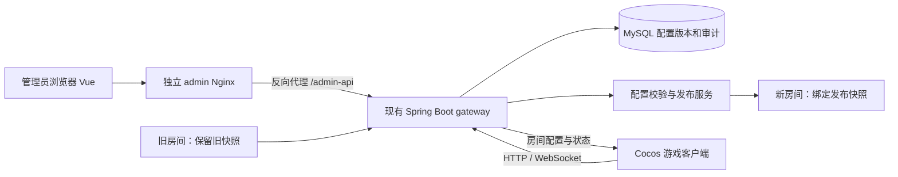

# 游戏配置管理后台方案与实现方式

日期：2026-10-08。状态：设计方案，尚未实现、构建或部署。依据当前仓库源码，不代表线上环境已经验证。

## 1. 目标与技术选择

建设独立网页管理后台，管理土地名称、租金、事件概率、随机金额等参数。管理员通过“编辑草稿 → 校验 → 发布”更新数据库配置；游戏服务为新建房间加载新配置，正在进行的房间保持原配置。

推荐：Vue 3 + TypeScript + Vite + Vue Router + Element Plus。后台页面独立放在 `web-manage/`，构建为静态文件，由独立 Nginx 服务部署；业务接口复用当前 Java 21 / Spring Boot gateway，数据库复用现有 MySQL，访问方式沿用 JdbcTemplate。

- Vue：适合表单、列表、路由和详情页；TypeScript 统一接口类型。官方说明：[快速开始](https://vuejs.org/guide/quick-start.html)、[TypeScript](https://vuejs.org/guide/typescript/overview)。
- Element Plus：复用数据表格、数字输入、表单校验、确认弹窗等组件。官方说明：[表单](https://element-plus.org/en-US/component/form)、[表格](https://element-plus.org/en-US/component/table)。
- Vite：编译后台静态产物，后台页面可以单独更新。官方说明：[生产构建](https://vite.dev/guide/build)、[静态部署](https://vite.dev/guide/static-deploy.html)。
- 后端继续使用 Spring Boot：发布校验、管理员鉴权、规则加载和资金结算都在服务端，不在 Vue 页面计算或执行。

React 也能完成同样功能，但当前开发计划已把管理后台定位为 Vue，没有需要切换到 React 的技术约束。普通 HTML 适合极少量固定表单；本次涉及多页配置、版本比较和发布流程，建议直接使用 Vue。首版无需引入微服务、SSR、Redis 或通用工作流平台。

开发时按现有运行环境选择兼容的依赖版本并提交锁文件，本方案不指定未经验证的最新版本。此文档只定义后台功能和实现方式，不替代待确认的界面设计稿。

## 2. 当前代码基础和必须改动的地方

已核查的现状：

1. `server/.../config/RuleConfig.java` 为不可变规则配置，含地产档位价格、车站价格、经济参数、事件权重及道具权重，并提供内容哈希。
2. `RuleConfigs.defaultV1()` 定义默认数值。`EconomyConfig` 已有 `eventCashMin`、`eventCashMax`、`eventCashStep`，当前奖励与罚款共用范围。
3. `ConfigValidator` 已校验权重总和、金额范围、候选数、派生金额和溢出。`RulesV1Spec` 固定地图组成等结构约束，价格和概率属于可调默认值，未被锁定。
4. `gateway/.../room/RoomService.java` 当前持有一个固定的 `Engine`，新房间共用这份配置。动态配置应改成按房间持有对应版本的引擎或复用同版本的不可变引擎。
5. `LiveRoom` 结局战绩目前调用 `service.configHash()`。改造后必须写入该房间引擎的哈希，避免旧局战绩被标记为新配置。
6. `client/.../core/BoardNames.ts` 保存土地名称；`net/ViewAdapter.ts` 仍从本地名称表和 `TIERS` 读取部分展示信息。只改服务端数据库会造成界面与结算不一致，需同步改客户端。
7. gateway 已接入 JDBC / Flyway；迁移资源在 `persistence/`，它当前不是独立 Maven 工程。当前迁移目录只有 V1，实际实施前再次检查下一个版本号。
8. `web/` 目前托管 Cocos H5 游戏产物。管理后台应另建部署目录，避免覆盖游戏页面。

## 3. 首版管理范围

### 3.1 土地和车站

按 30 格 / 50 格地图显示格子序号、类型、名称、档位，支持修改名称。格子身份固定使用 `boardId + tileIndex`，不能用可修改的名称当标识。

普通地产配置低、中、高三个档位的购买价、升级费和未升级、1级、2级、3级租金。车站配置购买价和每座未抵押车站对应的租金系数。保存时预览相关标准价值、抵押和拍卖金额，派生值按服务端现有规则计算。

首版价格按档位统一管理，符合现有 `TierPricing` 模型。同档位不同土地如需单独定价，增加逐格覆盖配置并改造 Pricing；这是后续扩展，不能只给页面增加输入框。

首版不开放格子类型、地图顺序、地产档位、最大升级等级和指定拍卖地的调整，避免突破现有地图与美术结构约束。

### 3.2 事件概率

管理现有事件类型的权重：现金奖励、现金罚款、获得道具、移动、入狱。事件权重采用整数百分比，总和必须为 100。可增加道具抽取权重页面，沿用千分比整数，总和为 1000，以准确表达 1.5% 等概率。

当前“事件概率”表示落到事件格后抽到哪一种结果的概率。它不等同于任意格子的事件触发率；首版保持落到事件格即进入事件流程。如需“事件格也有概率不触发”或“任意土地随机触发事件”，需另改规则和界面流程。

### 3.3 随机金额和固定费用

首版管理事件金额的最小值、最大值、步长，例如 100～500、步长50，候选为100、150……500，等概率抽取。与当前模型一致，奖励和罚款共用这组范围，并在页面明确注明。

另外可管理经过评审开放的固定经济参数：起点奖励、小游戏胜利奖励、支付出狱费用。

奖励与罚款分别设范围、为每个金额设置不同权重，属于第二阶段扩展，需增加规则配置字段、随机抽取逻辑及对应测试。随机结果始终由服务端产生，管理页面仅配置分布。

### 3.4 发布与历史

提供配置概览、地图命名、价格租金、事件概率、金额费用、发布历史六类页面。概览展示当前发布版本、规则机制版本、发布时间和发布人。草稿显示相对基线的变化；发布需要填写说明，展示差异并确认。

支持查看历史、从历史复制草稿、回滚。回滚生成一次新的发布记录并把当前版本指向旧快照，不修改旧版本内容。首版一个环境共用一套当前配置，不做玩家分组或随机灰度。

## 4. 架构与部署



后台页面独立部署，首版管理接口仍位于现有 gateway。管理员的静态服务、游戏 H5 静态服务和游戏后台分别发布。后台 Nginx 将 `/admin-api/` 代理到 gateway，浏览器侧使用同源请求；代理服务地址由部署环境配置，不写死在游戏客户端。

更新参数：写数据库、切换发布指针，不推 Git、不构建、不重启 gateway。更新 Vue 页面：只发布 admin 静态服务。更新游戏规则代码：仍要部署 gateway。新增图片资源或全新页面不在首版动态配置范围。

仓库 `prod` 推送可能触发后台自动部署，现有后台重启会解散房间。实施时需让 admin 发布流水线与后台发布解耦，使用目录过滤或独立发布入口；参数发布本身不经过流水线。本方案不改变目前对局只存内存的恢复限制。

## 5. 配置数据模型

建议使用带结构版本的 JSON 保存完整配置快照，关系字段保存版本身份、状态、并发控制和审计索引。网页是结构化表单，不要求管理员手写 JSON。

- `game_config_version`：配置ID、`schema_version`、机制版本 `rule_version`、基线版本、草稿修订号 `revision`、状态、规则JSON、展示JSON、规则哈希、整包哈希、创建/修改人及时间。已发布快照不可编辑。
- `game_config_active`：环境标识、当前配置ID、修订号、更新时间。每个环境一行，事务锁定这一行发布，避免同时发布覆盖。
- `game_config_audit`：操作者、动作、目标版本、前后版本、差异摘要、发布说明、时间和请求标识。配置切换与审计一起提交。
- `admin_account`：独立管理员账户、密码哈希、状态。普通游戏玩家身份不能自动获得管理权限。
- `admin_session`：随机会话令牌的哈希、账户ID、过期时间和撤销状态。数据库不保存明文令牌。

规则JSON直接对应 `RuleConfig`；展示JSON按地图保存 `tileNames` 等字段。整包哈希覆盖规则与展示内容，规则引擎仍使用现有 `RuleConfig.contentHash()`。仅改名称时规则哈希可以不变，但整包版本与哈希应变化。

区分三个概念：`rules-v1` 是规则机制版本；配置ID是每次保存/发布的版本身份；`schema_version` 是配置数据结构版本。调租金时不把 `rules-v1` 改成一个引擎不认识的版本名。

JSON存为 LONGTEXT，由 Java 解析与校验；不依赖 MySQL JSON 专属函数或 CHECK 在 MySQL 5.7 上生效。SQL使用现有项目适配方式与 `${table_options}`，同时验证 MySQL5.7 / H2兼容。新增下一版 Flyway 迁移，禁止改已执行的V1。

## 6. 保存、发布与房间加载

1. 从当前已发布版本复制草稿。编辑提交带 `revision`，数据库条件更新；版本已变化则返回冲突，不覆盖他人修改。
2. 保存和发布均执行服务端字段校验；发布再跑完整 `ConfigValidator`、名称与展示校验及客户端兼容性检查。前端校验只用于及时提示。
3. 发布请求带预期当前版本和幂等请求标识。事务锁定当前发布指针，检查草稿修订号，固化快照、切换指针、写审计；任何步骤失败全部回滚。
4. 首版新建房间时从数据库读取当前版本，加载不可变快照，创建或取同版本 `Engine`。避免只靠单进程内存通知而漏读更新；配置量很小，先保证正确。
5. 绑定在“创建房间”而非“点击开始游戏”时完成，确保等待大厅、新加入者和真正开局看到同一套数值。同房间后续局继续使用该快照，使用新配置需重建房间。
6. `LiveRoom` 固定保存配置ID、快照与对应引擎，后续结算、重连、战绩均引用它，不读取全局当前配置。
7. 发布不会给旧房间广播并覆盖规则。旧房间与新房间可同时运行不同配置版本。

首次迁移将当前默认规则及名称导入首个已发布版本，初始行为与现有游戏一致。配置缺失、损坏或数据库读取失败时阻止新房间创建并报告可定位错误，不能悄悄切回默认规则；已经持有完整快照的房间无需因读取配置失败而停止正常结算。

## 7. 接口和客户端接入

建议管理接口命名空间 `/admin-api/v1`，与当前玩家 `/api/**` 分开：

- `POST /auth/login`、`POST /auth/logout`、`GET /auth/me`：管理员登录和会话。
- `GET /configs/active`、`GET /configs`、`GET /configs/{id}`：当前、历史和详情。
- `POST /configs/drafts`：从指定版本创建草稿。
- `PUT /configs/drafts/{id}`：带修订号保存结构化配置。
- `POST /configs/drafts/{id}/validate`：返回字段路径和具体错误。
- `POST /configs/drafts/{id}/publish`：带预期当前版本、草稿修订号、发布说明和幂等标识。
- `POST /configs/rollback`：指定历史版本及预期当前版本，原子切换并记录审计。

客户端在房间首次快照/加入/重连时获得 `configId`、`schemaVersion`、`ruleVersion`、哈希和必要配置数据。全量配置只在首次或版本缺失时下发，后续状态推送带身份标识，无需每步重复整包。可提供经过成员权限检查的房间配置读取接口作为补拉路径。

改 `Protocol.ts`、`OnlineSession.ts`、`ViewAdapter.ts`，建立房间级只读配置上下文；土地名称、购买/升级费用、租金表、固定费用以及资产估值均从它读取，检查所有 `TIERS` / `STATION` / 本地规则常量调用点。玩法结算仍以服务端结果为准。

演示模式可以保留本地配置用于美术评审；联机模式不能在同步失败时无提示地使用演示默认值。状态到达但配置未齐时暂停相关操作，显示加载/重试信息。客户端不支持新的配置结构时阻止进入，并明确提示更新，不能带错误价格继续游戏。

首版限定为客户端已支持的结构和枚举，发布只调整已有字段；将来扩展结构时再增加客户端协议能力检查。名称仅允许普通文本、限制长度和控制字符，不通过配置执行脚本或导入任意资源地址。

## 8. 管理权限与校验

首版可只设一个管理员角色，后续再分编辑者和发布者。管理员登录独立于游戏微信登录和测试登录；密码采用成熟的自适应密码哈希实现，初始账户通过部署配置或一次性初始化流程创建，禁止把密码放入前端包。

建议后台使用 HTTPS，HttpOnly / Secure / SameSite Cookie保存会话，修改接口校验CSRF令牌；会话有过期时间、退出和禁用撤销。Nginx同源代理后不需开放任意来源跨域；若改成跨域部署，专门配置后台来源名单。当前玩家接口的宽泛CORS设置不能直接套给管理接口。

校验包括：事件/道具权重总和，金额上下界，步长大于0且能够整除区间，派生费用合法性与溢出，地图身份和结构固定，名称长度，未知字段拒绝，快照哈希，以及并发发布冲突。以现有 `ConfigValidator` 为最终规则约束，新增配置字段补相应校验。

现有候选数技术上限很宽，后台还应设置经过策划确认的业务上限，避免误输入导致不合理经济系统；方案不自行认定新的金额上限或禁止某事件的概率为0。

## 9. 目录与开发顺序

建议新增：

```text
web-manage/                    Vue管理界面、构建配置、Dockerfile、Nginx配置
gateway/.../admin/             管理员鉴权与配置管理接口
gateway/.../config/            ConfigRepository、ConfigService、发布与加载
persistence/.../migration/     新增版本配置、审计与管理员表的迁移
web-manage/admin-config-plan.md 本方案
```

第一步：数据库快照、服务端校验与发布、初始化当前默认配置；按房间选择引擎并修正战绩哈希来源。

第二步：客户端同步、展示与本地常量替换；先证明旧房间保持原配置，新房间使用新配置，所有玩家金额展示一致。

第三步：Vue管理后台、鉴权、编辑表单、差异预览和历史回滚；做页面评审与联调。

第四步：独立admin部署、发布流水线解耦、测试环境验收；再安排一次后台和客户端接入发布。后续参数更新走管理接口。

## 10. 验收与边界

- 改土地名称，新房间棋盘/资产/详情同步改变；土地身份、所有权和旧房间名称不变。
- 改各级租金，新房间详情表与实际收租一致；旧房间继续按旧金额结算。
- 改事件权重和金额范围，使用确定性随机输入验证边界与分桶；不靠少量抽卡样本判断正确性。
- 配置保存、发布、回滚、重复请求及并发冲突有测试；发布失败不留下部分切换状态。
- 非管理员不能查询管理数据或发布；过期/撤销会话失效，CSRF请求被拒绝。
- 加入、重连和房间后续局拿到原快照；战绩记录真实使用的规则哈希和配置身份。
- 现有迁移不变；新迁移按项目要求在H2测试执行，并单独验证MySQL5.7兼容。先在server执行mvn install，再在gateway执行mvn test；客户端执行现有类型检查、规则自检、Cocos构建及浏览器联调。
- 验证admin静态发布不会触发gateway重启；配置发布不会解散游戏。

本方案没有执行以上构建、测试、数据库变更或部署。参数动态化完成后，名称、租金、已有事件概率和金额范围不需发包；新增事件玩法、逐格定价结构、新界面及代码修复仍需代码发布。
